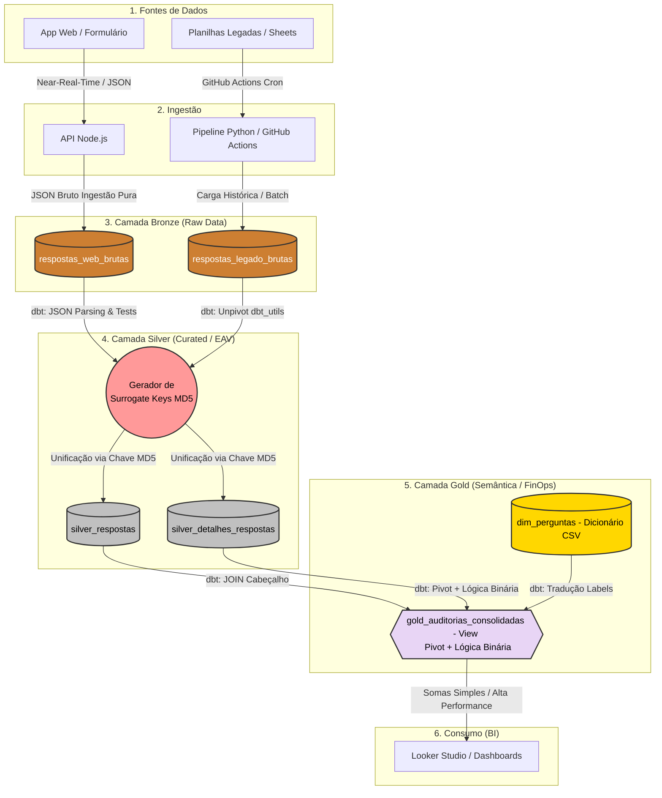

# Arquitetura do Sistema de Auditoria de Prontuários

Este documento fornece a visão geral de alto nível dos componentes do sistema, seus fluxos de dados e a infraestrutura tecnológica que suporta a operação de auditoria e análise de negócios.

## 1. Visão Geral do Sistema

O ecossistema foi desenhado para resolver o problema de colunas excessivas (Wide Table Problem) e concorrência de acessos, dividindo a responsabilidade em duas frentes de ingestão de dados que convergem para um Data Warehouse central (OLAP).

O sistema opera sob as seguintes camadas:
- **Client (Apresentação):** Aplicação web otimizada.
- **Ingestion API (Node.js):** Backend Node.js responsável pelas novas auditorias, operando com ingestão *near-real-time*.
- **Data Pipeline (ELT):** Automação em Python responsável pela ingestão em lote (batch) de dados legados.
- **Data Warehouse:** Armazenamento analítico (Google BigQuery) que atua como motor de processamento para o dbt sob a Arquitetura Medalhão.
- **Transformação e Qualidade (dbt):** Ferramenta centralizada responsável por desempacotar o JSON bruto (Parsing), aplicar testes de contrato (ACID) e materializar as regras de negócio nas camadas Silver e Gold.
- **Business Intelligence:** Camada de visualização (Looker Studio) operando sobre métricas binárias pré-calculadas.

---

## 1.1. Diagrama de Arquitetura e Linhagem (Data Lineage)

---

## 2. Componentes e Tecnologias

### 2.1. Ingestão Near-Real-Time (API Node.js)
Responsável por captar os dados preenchidos ativamente pelos auditores. Opera sob o conceito de **Ingestão Pura**, gerando um **UUIDv4** na origem para garantir a unicidade e empacotando todo o payload em um campo JSON bruto na camada Bronze. Delega 100% da responsabilidade de transformação e schema para o dbt, garantindo a atomicidade da transação.

### 2.2. Ingestão em Lote (Data Engineering / ELT)
Responsável por garantir a preservação histórica de dados legados. Utiliza **Python (Polars)** para manipulação de matrizes de dados em memória e orquestração via **GitHub Actions** em horários programados.

### 2.3. Data Warehouse & BI (Estratégia FinOps)
* **Armazenamento (Google BigQuery):** Repositório centralizado operando sob a **Arquitetura Medalhão**.
* **Camada Gold:** Além de resolver o padrão EAV, esta camada implementa a **Lógica Binária de Agregação**. 
* **Otimização de Performance:** Movemos a complexidade de cálculo (transformar "Conforme" em número) do Looker Studio para o BigQuery. Isso garante que o dashboard realize apenas operações de `SUM`, reduzindo o tempo de resposta e o custo de processamento.

### 2.4. Transformação e Padronização (O "Efeito Espelho")
A arquitetura resolve a disparidade estrutural entre o sistema novo (Web) e o antigo (Legado) logo na saída da camada Bronze utilizando o dbt. 
Para isso, foi implementada a estratégia de **"Efeito Espelho"**:
* **Origem Web (JSON):** O pacote bruto é desempacotado dinamicamente extraindo chaves e valores através de funções avançadas de array (`REGEXP_EXTRACT_ALL` e `UNNEST`).
* **Origem Legada (Wide Table):** A tabela estática de mais de 600 colunas horizontais é verticalizada utilizando a operação de `UNPIVOT`.
O resultado arquitetural é que ambas as fontes, por mais distintas que sejam na origem, convergem exatamente para a mesma estrutura vertical padronizada (ID do Atendimento, Pergunta, Resposta). Isso blinda a camada Silver e Gold de qualquer complexidade estrutural das origens.
* **Unificação (Surrogate Keys):** Como o sistema Web gera UUIDs nativos e o sistema Legado possui apenas datas e e-mails, o dbt gera uma Chave Substituta (Surrogate Key) aplicando um hash MD5 (`dbt_utils.generate_surrogate_key`) sobre os campos da origem. Isso garante uma chave primária universal, permitindo que a camada Silver faça o `UNION ALL` das duas fontes sem risco de colisão de IDs, documentado na ADR 0021.

> Para o mapeamento detalhado de todas as fontes (formato, frequência, volumetria e problemas conhecidos), consulte [Fontes de Dados](./docs/fontes_de_dados.md).
---

## 3. Registos de Decisões Arquiteturais (ADRs)

* [ADR 0001: Migração do Armazenamento (Sheets para BigQuery)](./docs/adr/0001-migracao-bigquery.md)
* [ADR 0002: Modelagem de Dados Vertical (Padrão EAV)](./docs/adr/0002-modelagem-eav.md)
* [ADR 0003: Inicialização da Aplicação com Padrão "Fail Fast"](./docs/adr/0003-fail-fast.md)
* [ADR 0004: Adoção da Arquitetura Medalhão e Ingestão com Python](./docs/adr/0004-arquitetura-medalhao-etl.md)
* [ADR 0005: Modelagem EAV para superação do 'Wide Table Problem' no Legado](./docs/adr/0005-modelagem-eav-para-dados-legados.md)
* [ADR 0006: Implementação da Camada Gold e Dicionário de Metadados via Python](./docs/adr/0006-camada-gold-e-dicionario-metadados.md)
* [ADR 0007: Implementação de Observabilidade e Logs Estruturados](./docs/adr/0007-observabilidade-logs-estruturados.md)
* [ADR 0008: Refatoração da Camada Silver para Modelo EAV Normalizado](./docs/adr/0008-refatoracao-camada-silver-eav.md)
* [ADR 0009: Validação Dinâmica de Datas no Front-end](./docs/adr/0009-validacao-dinamica-datas-frontend.md)
* [ADR 0010: Validação de Contrato (Schema Validation) Nativa na API](./docs/adr/0010-validacao-contrato-backend.md)
* [ADR 0011: Mascaramento Dinâmico de Dados Sensíveis (LGPD)](./docs/adr/0011-mascaramento-dados-sensiveis.md)
* [ADR 0012: Adoção do dbt para Auditoria e Qualidade de Dados](./docs/adr/0012-adocao-dbt-qualidade.md)
* [ADR 0013: IAM e Política de Privilégio Mínimo para Consumo de BI](./docs/adr/0013-iam-bi-least-privilege.md)
* [ADR 0014: Implementação de Lógica Binária para Métricas de Conformidade](./docs/adr/0014-logica-binaria-conformidade.md)
* [ADR 0015: Utilização do tipo de dado JSON para armazenamento bruto na Camada Bronze da API](./docs/adr/0015-utilizacao-tipo-json-camada-bronze-api.md)
* [ADR 0016: Setup do dbt Cloud e Integração com BigQuery e GitHub](./docs/adr/0016-setup-dbt-cloud-bigquery.md)
* [ADR 0017: Migração para Ingestão Pura (ELT) e Centralização de Transformações no dbt](./docs/adr/0017-migracao-ingestao-pura.md)
* [ADR 0018: Limpeza de Metadados na Camada Staging utilizando Jinja](./docs/adr/0018-limpeza-metadados-staging-jinja.md)
* [ADR 0019: UNPIVOT do Sistema Legado utilizando pacote dbt_utils](./docs/adr/0019-unpivot-sistema-legado-dbt-utils.md)
* [ADR 0020: Extração Dinâmica de JSON (Unpivot) na Camada Staging (Web)](./docs/adr/0020-extracao-json-dinamico-web.md)
* [ADR 0021: Implementação de Surrogate Keys (MD5) para Unificação de Auditorias](./docs/adr/0021-implementacao-surrogate_key-unificacao-auditorias.md)
* [ADR 0022: Orquestração do Pipeline Legado via GitHub Actions](./docs/adr/0022-orquestracao-legado-github-actions.md)
* [ADR 0023: Desacoplamento de Transformação do BI e Consumo Exclusivo da Camada Gold](./docs/adr/0023-desacoplamento-transformacao-looker-studio.md)
