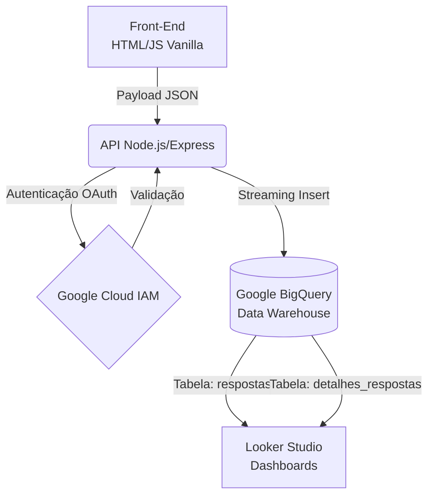

# Sistema de Auditoria de Prontuários (Data Architecture & App)

Um ecossistema completo (App Web + API + Data Warehouse + BI) construído para resolver o desafio de escalabilidade na auditoria de milhares de prontuários hospitalares simultâneos, transformando dados qualitativos e quantitativos em inteligência de negócio.

## O Problema (Contexto do Negócio)

A auditoria clínica exige a avaliação minuciosa de mais de 600 itens por prontuário (desde a triagem até planos terapêuticos complexos). Originalmente, esses dados eram salvos em uma única aba de planilha. Com o aumento do volume de auditorias, o projeto esbarrou no clássico **"Wide Table Problem" (Problema da Tabela Larga)**:

* Painéis no Looker Studio sofriam com alta latência ao ler centenas de colunas simultaneamente.
* As "Observações" (textos abertos dos médicos) ficavam isoladas em colunas específicas, impossibilitando cruzamentos ágeis com as não conformidades.
* Risco elevado de concorrência e perda de dados com múltiplos auditores salvando registros no mesmo instante.

## A Solução e Arquitetura

Desenvolvi uma API robusta e migrei a camada de armazenamento para um Data Warehouse corporativo, normalizando os dados para garantir performance analítica e escalabilidade.

### Diagrama de Arquitetura

1. **Front-end Dinâmico**: Formulário web reativo. As listas de parametrização (Setores e Especialidades) são consumidas em tempo real do banco de dados via API REST (GET).

2. **Back-end & API (Node.js/Express)**: Uma API assíncrona que recebe o payload do front-end, gera chaves únicas (UUIDv4) e gerencia as regras de negócio. Implementa o padrão Fail Fast para conexões de banco de dados.

3. **Data Warehouse (Google BigQuery)**: Modelagem de dados relacional desenhada especificamente para alta performance no BI.

4. **Data Visualization (Looker Studio)**: Dashboards gerenciais otimizados, filtrando conformidades e observações textuais em milissegundos.

---

## Modelagem de Dados e Normalização
Em vez de persistir 600 colunas fixas, a API intercepta o payload e realiza o Unpivot dos dados em tempo real usando a BigQuery Streaming API, dividindo as informações em duas entidades relacionais:
- **Tabela** `respostas` **(Cabeçalho)**: 1 linha por auditoria. Armazena os metadados principais (Quem auditou, Setor avaliado, Data, Número do Atendimento).
- **Tabela** `detalhes_respostas` **(EAV Model - Entity-Attribute-Value)**: Registros verticais vinculados via Foreign Key (ID da auditoria). Se o auditor preencher 40 itens, a API gera 40 linhas estruturadas.
    - **Impacto**: Consultas SQL tornaram-se modulares. O Looker Studio agora processa filtros complexos de forma instantânea.

---

## Tecnologias Utilizadas
- **Back-end**: Node.js, Express.js, UUID, dotenv.
- **Banco de Dados / DW**: Google BigQuery (Streaming API).
- **Segurança**: Autenticação via Google Cloud Service Account (JSON/OAuth) isolada em variáveis de ambiente.
- **Front-end**: HTML5, CSS3, Bootstrap 4, JS Vanilla (Fetch API).
- **Data Visualization / BI**: Google Looker Studio.
- **Hospedagem & CI/CD**: Render.com.

---

## Métricas de Impacto e Valor
- **Performance do BI**: Fim da latência no Looker Studio ao mudar o paradigma de colunamento para um modelo tabular vertical (Long Data).
- **Integridade de Dados**: Eliminação da perda de dados em acessos concorrentes através da arquitetura distribuída do BigQuery.
- **Análise Qualitativa**: Consolidação das observações médicas nos relatórios, permitindo a criação de planos de ação baseados em causa-raiz (ex: identificar exatamente o motivo de falha em um protocolo de profilaxia).

---

## Próximos Passos (Roadmap)
- [ ] Desativar a escrita dupla (Dual-write) legada no Google Sheets após a fase de homologação dos dados no BigQuery.

- [ ] Implementar logs de aplicação estruturados (ex: bibliotecas Winston/Morgan).

- [ ] Desenvolver testes unitários para a validação do payload na API.