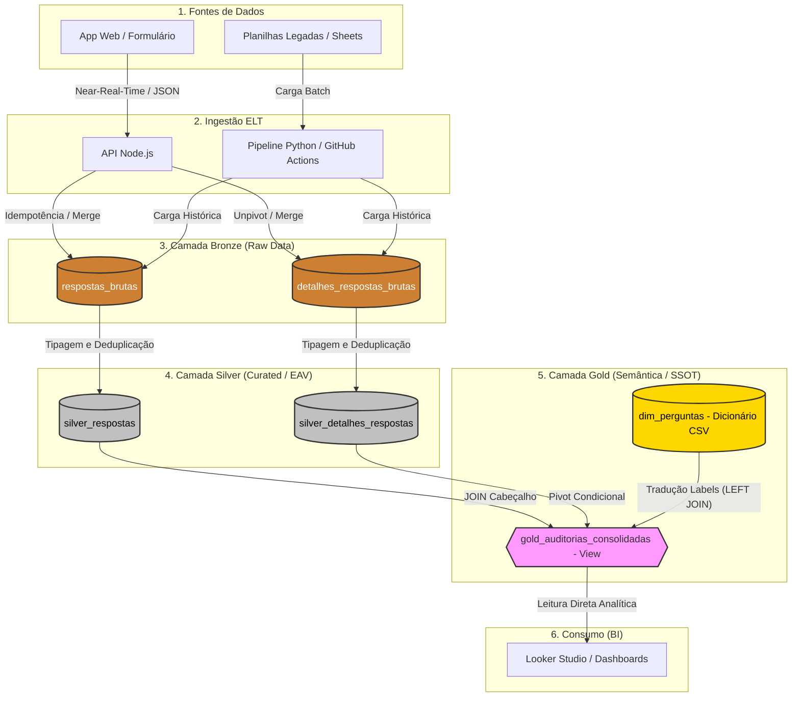

# Sistema de Auditoria de Prontuários (Data Architecture & App)

Um ecossistema completo (App Web + API + Data Warehouse + BI) construído para resolver o desafio de escalabilidade na auditoria de milhares de prontuários hospitalares simultâneos, transformando dados qualitativos e quantitativos em inteligência de negócio.

## 1. O Problema (Contexto do Negócio)

A auditoria clínica exige a avaliação minuciosa de mais de 600 itens por prontuário. Originalmente, esses dados eram salvos de forma plana em uma única aba de planilha do Google Sheets. Com a escala do projeto, esbarramos em limitações críticas de engenharia:
* **"Wide Table Problem":** Painéis no Looker Studio sofriam com alta latência (ou quebravam) ao tentar ler centenas de colunas horizontais com alta esparsidade (valores nulos).
* **Perda de Dados por Concorrência:** Risco elevado de *locks* e sobrescrita de dados com múltiplos auditores tentando salvar registros no exato mesmo instante.
* **Silos Qualitativos:** As "Observações" médicas ficavam perdidas, dificultando o cruzamento ágil de causa-raiz para as não-conformidades.

## 2. A Solução e Arquitetura

Desenvolvi uma arquitetura de dados moderna, substituindo o armazenamento transacional frágil por um Data Warehouse robusto (Google BigQuery) orientado a Analytics (OLAP). O pipeline implementa a **Arquitetura Medalhão (Medallion Architecture)** e adota o paradigma **ELT** (Extract, Load, Transform), com duas vias de ingestão: batch (legado) e near-real-time (novos dados).

## 3. Destaques da Engenharia (Ponta a Ponta)

1. **Garantia de Integridade e Concorrência**:
   - Geração de **UUIDv4** na origem (API) para cada auditoria. O uso de chaves compostas e operações de `MERGE` garantem a **idempotência** dos scripts na Camada Silver (rodar o pipeline N vezes não duplica os dados) e elimina a perda de dados por acessos simultâneos.
2. **Modelagem EAV para o "Wide Table Problem"**:
   - As 600+ colunas horizontais do legado foram transformadas via `UNPIVOT` em um modelo vertical **Entity-Attribute-Value (EAV)**. O banco agora cresce em linhas, não em colunas, suportando a adição de novas perguntas no formulário sem necessidade de alteração de *schema* estrutural (ADR 0005).
3. **Docs-as-Code e Single Source of Truth (SSOT)**:
   - Extração automatizada de metadados em Python (via *Abstract Syntax Trees - AST*) diretamente do código-fonte do Front-end. Isso gera um Dicionário de Dados perfeito (`dim_perguntas`) para a Camada Gold, garantindo que o texto exibido no BI seja 100% idêntico à interface do médico (ADR 0006).
4. **Camada Gold (Consumo Transparente no BI)**:
   - O consumo no Looker Studio é intermediado por uma **View Consolidada** que resolve o modelo EAV através de um *Pivot Condicional*. Ela junta as "Respostas" e "Observações" na mesma linha e cruza com o Dicionário de Dados, expondo métricas limpas sem exigir cálculos pesados na ferramenta de BI.
5. **ELT em Lote Avançado (Python/Polars)**:
   - Extração que resolve *Shape Errors* na memória RAM usando `Polars` e `BytesIO`, orquestrado via GitHub Actions em instâncias efêmeras (Linux) a cada 6 horas.
6. **API com "Fail Fast"**:
   - O backend em Node.js valida chaves de serviço e variáveis de ambiente no *boot*, impedindo que a aplicação suba "cega" e receba tráfego se não conseguir se conectar ao Data Warehouse.
7. **Observabilidade e Logs Estruturados**:
   - API Node.js implementada com logs em JSON e `request_id`, permitindo rastreio total desde o clique do auditor até a gravação no banco. 
8. **Governança no Front-end**:
   - Validação dinâmica de datas (Mês Anterior/Atual) para impedir a entrada de "lixo" cronológico no DW. 
9. **Privacy by Design (LGPD & Data Masking)**:
   - Implementação de barreira dupla de privacidade a custo zero. No front-end, "Nudges" visuais orientam os auditores a não inserir dados pessoais. No Data Warehouse (Camada Gold), um Censor Matemático (Regex) mascara automaticamente (`[CENSURADO]`) CPFs, RGs e números de prontuários inseridos por engano nos campos de texto livre.
10. **Data Quality & Contratos de Dados (dbt)**:
   - Implementação de um auditor independente usando o Data Build Tool (dbt). Criação de Contratos de Dados (`schema.yml`) para validar a Camada Prata através de testes rigorosos (`not_null`, `unique`, `accepted_values`). A arquitetura isola a dívida técnica legada usando filtros SQL avançados, aplicando o modelo de segurança "Defesa em Profundidade".

## 4. Métricas de Impacto e Valor

* **Escala Histórica:** Processamento e ingestão bem-sucedida de **104.820 linhas históricas** legadas, padronizando o passado e o presente na mesma modelagem EAV.
* **Performance Analítica:** Redução drástica no tempo de carregamento dos Dashboards (de ~40 segundos no Google Sheets para < 3 segundos nativos no BigQuery).
* **Otimização de Armazenamento:** A eliminação de mais de 600 colunas fixas erradicou os dados "vazios" (nulos) do banco, economizando processamento de leitura (FinOps).
* **Alta Disponibilidade:** O novo ecossistema suporta escalabilidade horizontal, permitindo **dezenas de auditores simultâneos** sem travamentos de planilha ou *locks* de linha.

## 5. Tecnologias Utilizadas
- **Data Engineering (ELT)**: Python 3.11 (Polars, AST, Regex), Google BigQuery, SQL Analítico (MERGE, UNPIVOT, PIVOT Condicional).
- **Software Engineering (API/Web)**: Node.js, Express.js, HTML5/JS Vanilla.
- **Orquestração & CI/CD**: GitHub Actions (Cron Jobs), Gitflow simplificado.
- **Data Visualization**: Looker Studio.
- **Observabilidade:** Logs Estruturados JSON (Severity-based).

## 6. Documentação e Decisões
Este projeto adota o padrão de **Architecture Decision Records (ADRs)** para rastreabilidade técnica. Acesse o histórico na pasta `docs/adr/`. 
Consulte também o nosso [Guia de Contribuição](./CONTRIBUTING.md) e o [Changelog](./CHANGELOG.md).

## 7. Próximos Passos (Engineering Roadmap)

### FinOps & Performance Avançada (CONCLUÍDO)
- [x] **Modelagem Silver EAV:** Normalização completa das tabelas `silver_respostas` e `silver_detalhes_respostas`.
- [x] **Dicionário de Dados:** Documentação técnica de todos os campos e metadados.
- [x] **Arquitetura de Views:** Implementação da Camada Gold com Pivot Condicional.

### Governança Ativa & Observabilidade (EM ANDAMENTO)
- [x] **Observabilidade na API:** Logs estruturados com `request_id` implementados.
- [x] **Governança de Dados (Front):** Trava dinâmica de datas no calendário.
- [x] **Validação de Contrato (Schema Validation):** Bloqueio de payloads inválidos na API.
- [x] **Data Masking (LGPD):** Mascaramento dinâmico de dados sensíveis na View Gold.
- [x] **Qualidade de Dados (Data Quality Tests):** Implementar testes de integridade. Integrar dbt para alertar se um payload da API vier com nulos onde não deveria.

### Entrega de Valor & Data Discovery (PRÓXIMA ETAPA)
- [ ] **Dashboard Base no Looker Studio:** Conexão da View Gold e criação de KPIs de conformidade.
- [ ] **Data Security (IAM):** Configuração de permissões Read-Only para a conta de serviço do BI.

---
### Desenvolvido por:
**Ediney Magalhães**
#### *Analytics Engineer / Data Engineer / Estatístico*
