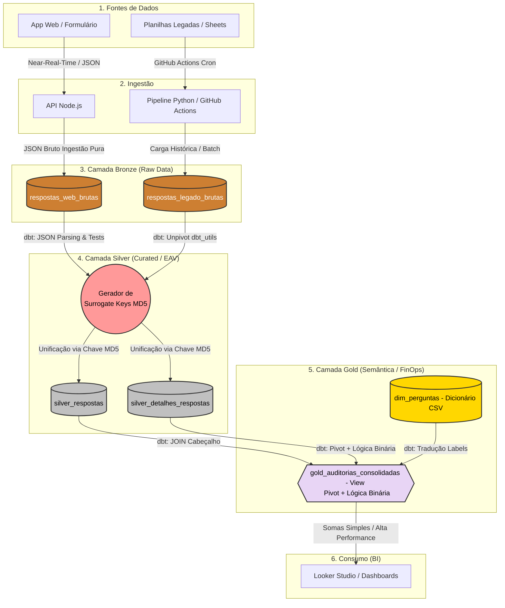

# Data Analytics: Auditoria de Prontuários Hospitalares

 
 

Um ecossistema de dados completo (App Web + Pipeline Híbrido + dbt + BI) desenvolvido para automatizar a auditoria clínica de um grupo hospitalar com 9 unidades. O projeto soluciona o desafio de consolidar dados qualitativos complexos em inteligência estratégica em tempo real.

## O Impacto em Números
* **Performance de BI:** Redução de **76%** no tempo de carregamento do dashboard (de **11,8s** para **2,8s**) e de **24 páginas** para **5 páginas**, resultado da migração de cálculos para o BigQuery via dbt e reestruturação do relatório.
* **Escalabilidade:** Ingestão e processamento de **104.820+ linhas** históricas unificadas a dados em tempo real.
* **Confiabilidade:** 100% de automação na consolidação de dados, eliminando erros manuais e garantindo *Single Source of Truth* (SSOT).

## Métricas de Negócio
O dashboard entrega a **Taxa de Conformidade** (qtde_conforme / qtde_validos) com os seguintes cortes analíticos:
* Por **unidade hospitalar**
* Por **setor** (UTI, Pronto Socorro, Centro Cirúrgico, etc.)
* Por **tipo de prontuário** (Clínico, Cirúrgico, Obstétrico, etc.)
* Por **especialidade médica**
* Por **avaliador**
* Por **período** (filtro temporal)

## Usuários Finais
* **Comissão de Prontuários** — responsável pela governança e padrão de qualidade dos registros clínicos
* **Coordenadores de Qualidade** — acompanham indicadores de conformidade e definem planos de ação
* **Gestores das unidades** — monitoram o desempenho da sua unidade em relação às demais

## O Desafio Técnico: Da Planilha à Modern Data Stack
O projeto evoluiu de uma gestão manual e descentralizada para uma arquitetura analítica:
1.  **Fase de Caos:** Planilhas isoladas e semanas para consolidar um relatório mensal.
2.  **Gargalo Técnico:** Transição para App Web, enfrentando o *Wide Table Problem* (mais de 600 colunas dinâmicas) que inviabilizava a performance no BI.
3.  **Maturidade (Solução Atual):** Implementação de uma **Arquitetura Medalhão** (Bronze, Silver, Gold) com processamento ELT focado em performance e segurança (LGPD).

## Arquitetura de Dados Híbrida
O diferencial é a capacidade de unir dois mundos:
* **Near-Real-Time (API Node.js):** Captação ativa via formulário web moderno, salvando pacotes JSON brutos para flexibilidade de schema.
* **Batch Legado (Python + GitHub Actions):** Automação programada que resgata dados históricos de sistemas antigos (Google Sheets) sem intervenção humana.

### Linhagem de Dados (Data Lineage)

## Destaques da Engenharia
* **Modelagem EAV & Unpivot Dinâmico:** Conversão de estruturas horizontais massivas em um modelo vertical escalável, permitindo adicionar perguntas ao checklist sem alterar o schema do banco de dados.
* **Surrogate Keys (MD5):** Unificação de origens distintas (Web e Legado) através de chaves inteligentes geradas pelo dbt, garantindo integridade e evitando colisão de registros.
* **FinOps & Performance:** Transferência de toda a carga de cálculo (lógica binária de conformidade) do Looker Studio para o BigQuery via dbt, otimizando custos e tempo de resposta.
* **Privacy by Design (LGPD):** Algoritmo de mascaramento automático de dados sensíveis (CPFs, telefones) via Regex na camada Gold.

## Visualização de Dados
*(Espaço reservado para o print do Dashboard do Looker Studio)*

## Tecnologias Utilizadas
- **Data Engineering**: Python 3.11 (Polars, AST), dbt, SQL Analítico (BigQuery).
- **Software Engineering**: Node.js, Express.js, HTML5/JS Vanilla.
- **Orquestração & CI/CD**: GitHub Actions, Gitflow.
- **Data Visualization**: Looker Studio.
- **Armazenamento de Dados:** Google BigQuery (Data Warehouse).
- **Transformação de Dados (ETL/ELT):** dbt (Data Build Tool) via dbt Cloud.
- **Versionamento:** Git e GitHub.

---
### Explore a Documentação
Para detalhes técnicos profundos, consulte:
* [**Arquitetura Detalhada**](./ARCHITECTURE.md): Fluxos, diagramas e topologia.
* [**Dicionário de Dados**](./dicionario_dados.md): Definição de tabelas, tipos e métricas.
* [**Guia de Contribuição**](./CONTRIBUTING.md): Como configurar o ambiente e padrões de código.
* [**ADRs**](./docs/adr/): O registro de todas as decisões arquiteturais do projeto.
* [**Fontes de Dados**](./docs/fontes_de_dados.md): Mapeamento completo das origens, volumetria e problemas conhecidos.

---
### Desenvolvido por:
**Ediney Magalhães**
#### *Analytics Engineer / Data Engineer / Estatístico*
