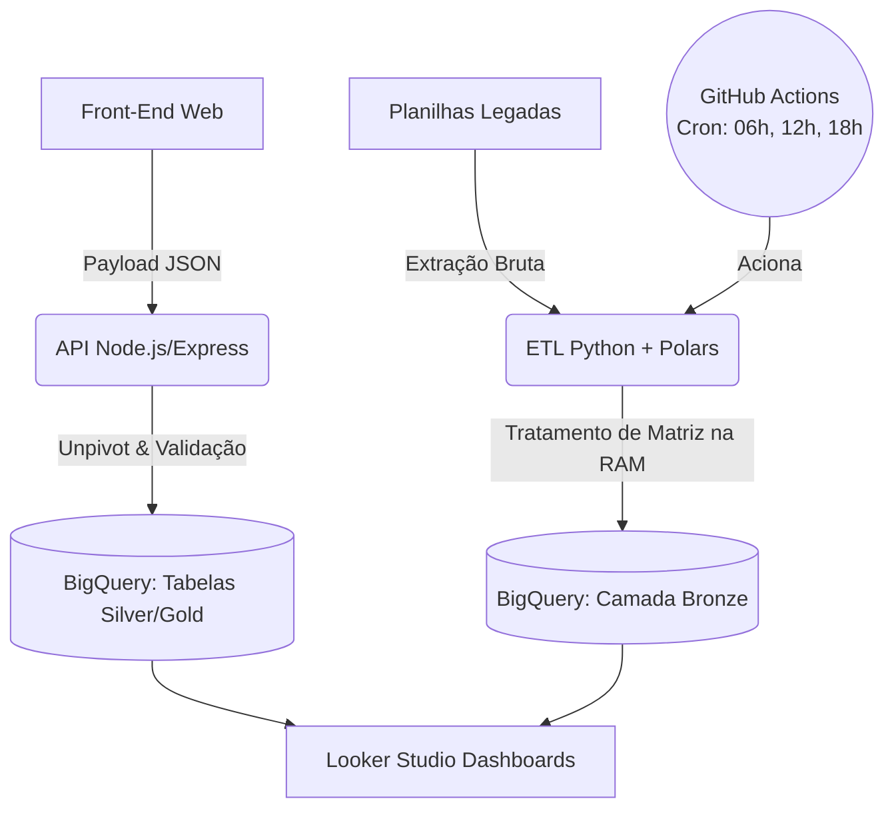

# Sistema de Auditoria de Prontuários (Data Architecture & App)

Um ecossistema completo (App Web + API + Data Warehouse + BI) construído para resolver o desafio de escalabilidade na auditoria de milhares de prontuários hospitalares simultâneos, transformando dados qualitativos e quantitativos em inteligência de negócio.

## O Problema (Contexto do Negócio)

A auditoria clínica exige a avaliação minuciosa de mais de 600 itens por prontuário. Originalmente, esses dados eram salvos de forma plana em uma única aba de planilha do Google Sheets. Com a escala do projeto, esbarramos em limitações críticas:
* **"Wide Table Problem":** Painéis no Looker Studio sofriam com alta latência (ou quebravam) ao tentar ler centenas de colunas simultaneamente.
* **Perda de Dados (Concorrência):** Risco elevado de sobrescrita com múltiplos auditores salvando registros no mesmo instante.
* **Silos Qualitativos:** As "Observações" médicas ficavam isoladas em colunas específicas, dificultando cruzamentos de causa-raiz para não conformidades.

## A Solução e Arquitetura

Desenvolvi uma arquitetura híbrida dividida em duas frentes de ingestão que convergem para um Data Warehouse corporativo (Google BigQuery), aplicando o conceito de **Arquitetura Medalhão (Medallion Architecture)** e modelagem orientada a Analytics (OLAP).

## Destaques da Engenharia (Ponta a Ponta)
1. **ETL em Lote e Orquestração (Python/Polars)**: - Script de extração que resolve Shape Errors (linhas irregulares) na memória RAM usando `Polars` e `BytesIO`.
    - Pipeline de CI/CD automatizado com **GitHub Actions**, rodando instâncias efêmeras em Linux três vezes ao dia (06h, 12h e 18h) para garantir a integridade da camada `bronze_legado_respostas`.

2. **API Real-Time e Tratamento de Erros (Node.js)**: - Backend operando com o padrão ***Fail Fast*** (valida credenciais antes de subir o servidor).
    - Intercepta o payload do front-end e realiza o Unpivot dos dados em tempo real usando a BigQuery Streaming API.

3. **Modelagem de Dados (SQL)**: - Adoção do modelo **EAV (Entity-Attribute-Value)**. Em vez de 600 colunas, o banco armazena dados em duas tabelas relacionais (`respostas` para metadados e `detalhes_respostas` para granularidade).

## Métricas de Impacto e Valor
- **Performance do BI**: Fim da latência no Looker Studio ao mudar o paradigma de colunamento horizontal para um modelo tabular vertical estruturado.
- **Integridade de Dados**: Eliminação da perda de dados por acessos concorrentes através da arquitetura distribuída.
- **Governança**: Separação clara entre dados brutos (Bronze) e dados modelados (Silver/Gold), permitindo auditoria histórica sem impactar o sistema em produção.

## Tecnologias Utilizadas
- **Engenharia de Dados**: Python 3.11, Polars, Google BigQuery.
- **Engenharia de Software (API/Web)**: Node.js, Express.js, JS Vanilla, HTML5/CSS3.
- **Orquestração & CI/CD**: GitHub Actions (Cron Jobs), Git/GitHub (Conventional Commits).
- **Segurança**: Google Cloud IAM (Service Accounts), `.env` para gestão de secrets.
- **Data Visualization**: Looker Studio.

## Documentação e Decisões
Este projeto adota o padrão de **Architecture Decision Records (ADRs)** para rastreabilidade de decisões técnicas. Acesse o histórico na pasta `docs/adr/`.
Consulte também o nosso [Guia de Contribuição](./CONTRIBUTING.md) e o [Changelog](./CHANGELOG.md).

## Próximos Passos (Roadmap)
[ ] Construir as transformações SQL na Camada Silver no BigQuery para limpeza das tipagens (datas e categorias) dos dados da Camada Bronze.

[ ] Implementar logs de aplicação estruturados na API (ex: Winston/Morgan).

[ ] Desenvolver testes unitários para a validação do payload do formulário.

## Desenvolvido por:
### Ediney Magalhães
- Analytics Engineer / Data Engineer / Estatistico