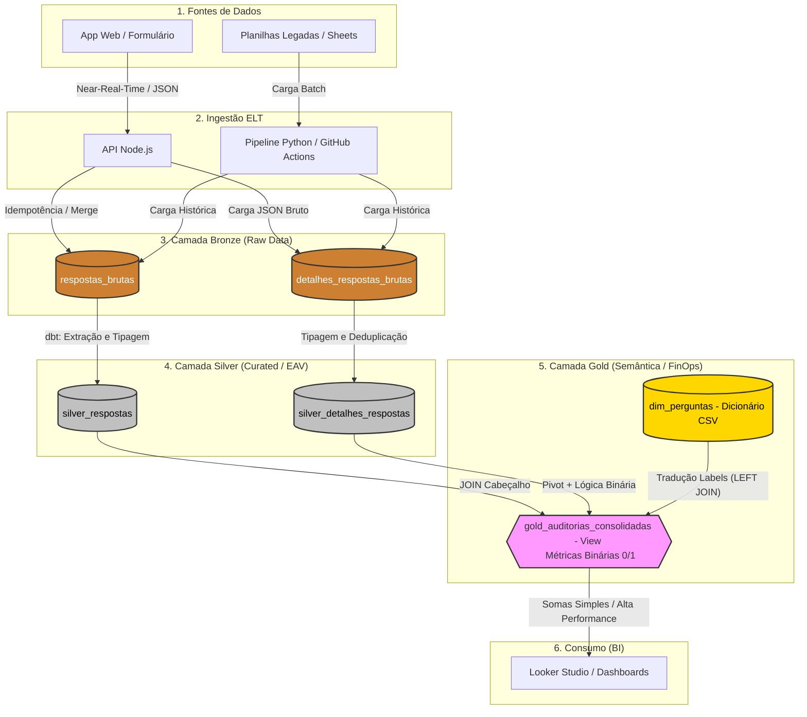

# Sistema de Auditoria de Prontuários (Data Architecture & App)

Um ecossistema completo (App Web + API + Data Warehouse + BI) construído para resolver o desafio de escalabilidade na auditoria de milhares de prontuários hospitalares simultâneos, transformando dados qualitativos e quantitativos em inteligência de negócio.

## 1. O Problema (Contexto do Negócio)

A auditoria clínica exige a avaliação minuciosa de mais de 600 itens por prontuário. Originalmente, esses dados eram salvos de forma plana em uma única aba de planilha do Google Sheets. Com a escala do projeto, esbarramos em limitações críticas de engenharia:
* **"Wide Table Problem":** Painéis no Looker Studio sofriam com alta latência (ou quebravam) ao tentar ler centenas de colunas horizontais com alta esparsidade (valores nulos).
* **Perda de Dados por Concorrência:** Risco elevado de *locks* e sobrescrita de dados com múltiplos auditores tentando salvar registros no exato mesmo instante.
* **Silos Qualitativos:** As "Observações" médicas ficavam perdidas, dificultando o cruzamento ágil de causa-raiz para as não-conformidades.

## 2. A Solução e Arquitetura

Desenvolvi uma arquitetura moderna orientada a Analytics (OLAP) no **Google BigQuery**. O pipeline implementa a **Arquitetura Medalhão** e adota o paradigma **ELT**, com processamento incremental para otimização de custos (FinOps).

## 3. Destaques da Engenharia (Ponta a Ponta)
1. **Garantia de Integridade e Idempotência**: Geração de **UUIDv4** na origem e uso de comandos `MERGE` garantem que reprocessar o pipeline não gere duplicidade.
2. **Modelagem EAV (Verticalização)**: Conversão de 600+ colunas horizontais em um modelo vertical. O banco cresce em linhas, permitindo novas perguntas sem alterar o schema (ADR 0005).
3. **Métricas Binárias (Estratégia FinOps)**: Implementação de lógica $0$ e $1$ (`qtde_conforme` e `qtde_valida`) diretamente no SQL. Isso elimina cálculos pesados de texto no Looker Studio, reduzindo a latência e o custo de processamento (ADR 0014).
4. **Docs-as-Code (SSOT)**: Extração automatizada de metadados do Front-end via Python (AST), garantindo que o BI exiba exatamente o que o médico vê no formulário.
5. **Data Quality & Contratos (dbt)**: Implementação do dbt para orquestrar a extração tipada de campos complexos (JSON), garantindo que o dado chegue limpo e materializado para a camada analítica. O uso de testes automatizados assegura a integridade das chaves primárias e campos obrigatórios antes do consumo no BI.
6. **Privacy by Design (LGPD)**: Mascaramento dinâmico via Regex (`[CENSURADO]`) na Camada Gold para proteger dados sensíveis inseridos em campos de texto livre.
7. **Segurança e Privilégio Mínimo**: Implementação de política de IAM com Service Accounts dedicadas e restritas para o consumo do Looker Studio (ADR 0013).
8. **Observabilidade**: API Node.js com logs estruturados em JSON e `request_id` para rastreio total do ciclo de vida do dado.

## 4. Métricas de Impacto e Valor

* **Escala Histórica:** Ingestão de **104.820 linhas** legadas padronizadas sob o modelo EAV.
* **Performance Analítica:** Redução no tempo de carregamento do Dashboard de ~40s (Sheets) para **< 3s** (BigQuery).
* **FinOps:** Economia de processamento ao evitar leitura de colunas nulas e simplificar agregações no BI.

## 5. Tecnologias Utilizadas
- **Data Engineering**: Python 3.11 (Polars, AST), dbt, SQL Analítico (BigQuery).
- **Software Engineering**: Node.js, Express.js, HTML5/JS Vanilla.
- **Orquestração & CI/CD**: GitHub Actions, Gitflow.
- **Data Visualization**: Looker Studio.
- **Armazenamento de Dados:** Google BigQuery (Data Warehouse).
- **Transformação de Dados (ETL/ELT):** dbt (Data Build Tool) via dbt Cloud.
- **Versionamento:** Git e GitHub.

## 6. Documentação e Decisões
Este projeto utiliza **ADRs** para rastreabilidade técnica. Consulte a pasta `docs/adr/`. Veja também o [Guia de Contribuição](./CONTRIBUTING.md).

## 7. Próximos Passos (Engineering Roadmap)

### Infraestrutura e Governança (CONCLUÍDO)
- [x] **Modelagem Silver EAV:** Normalização completa das tabelas.
- [x] **Data Quality (dbt):** Testes de integridade automatizados.
- [x] **Data Masking (LGPD):** Mascaramento de dados sensíveis.
- [x] **Métricas FinOps:** Lógica binária 0/1 implementada no DW.
- [x] **Security (IAM):** Conta de serviço com privilégio mínimo para o BI.
### Fase 1: Fundação (Setup & Conexão) [CONCLUÍDO]
- [x] Criar conta no dbt Cloud.
- [x] Conectar dbt ao GitHub e ao BigQuery via Service Account.
- [x] Resolver travas de Billing/Sandbox no Google Cloud.
### Fase 2: O Ponto de Partida (Sources & Bronze) [CONCLUÍDO]
- [x] Configurar `sources.yml` para mapear os dados brutos.
- [x] Validar leitura das tabelas `bronze_respostas_web` e `bronze_legado_respostas`.
### Fase 3: A Grande Transformação (Silver) [EM ANDAMENTO]
- [x] Modelo SQL para extração e tipagem do JSON (`stg_bronze_respostas_web`).
- [ ] Modelo SQL com `UNPIVOT` para as 600 colunas do legado.
- [ ] Consolidação via `UNION ALL` nas tabelas `silver_respostas` e `silver_detalhes`.
## Fase 4: Controle de Qualidade (Testes) [PENDENTE]
- [ ] Configurar testes de unicidade e nulidade no `schema.yml`.
- [ ] Validar integridade dos UUIDs gerados.
## Fase 5: Entrega de Valor (Gold) [PENDENTE]
- [ ] Migrar `gold_auditorias_consolidadas` para o dbt.
- [ ] Aplicar lógica binária (0/1) e JOIN com dicionário de perguntas.
### Fase 6: Automação (Jobs e Deploy) [PENDENTE]
- [ ] Agendar Jobs de execução automática no dbt Cloud.
## Fase 7: Desacoplamento da API (Opcional) [PENDENTE]
- [ ] Simplificar `index.js` para salvar apenas o JSON bruto, delegando o processamento 100% ao dbt.

---
### Desenvolvido por:
**Ediney Magalhães**
#### *Analytics Engineer / Data Engineer / Estatístico*
