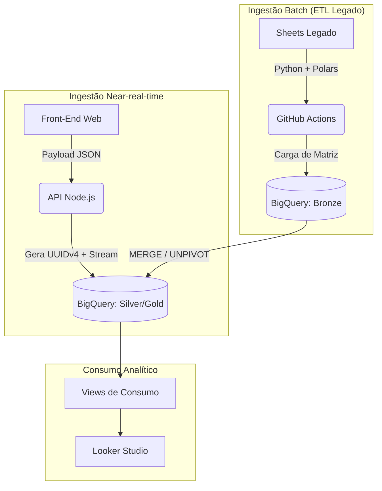

# Sistema de Auditoria de Prontuários (Data Architecture & App)

Um ecossistema completo (App Web + API + Data Warehouse + BI) construído para resolver o desafio de escalabilidade na auditoria de milhares de prontuários hospitalares simultâneos, transformando dados qualitativos e quantitativos em inteligência de negócio.

## 1. O Problema (Contexto do Negócio)

A auditoria clínica exige a avaliação minuciosa de mais de 600 itens por prontuário. Originalmente, esses dados eram salvos de forma plana em uma única aba de planilha do Google Sheets. Com a escala do projeto, esbarramos em limitações críticas de engenharia:
* **"Wide Table Problem":** Painéis no Looker Studio sofriam com alta latência (ou quebravam) ao tentar ler centenas de colunas horizontais com alta esparsidade (valores nulos).
* **Perda de Dados por Concorrência:** Risco elevado de *locks* e sobrescrita de dados com múltiplos auditores tentando salvar registros no exato mesmo instante.
* **Silos Qualitativos:** As "Observações" médicas ficavam perdidas, dificultando o cruzamento ágil de causa-raiz para as não-conformidades.

## 2. A Solução e Arquitetura

Desenvolvi uma arquitetura de dados moderna, substituindo o armazenamento transacional frágil por um Data Warehouse robusto (Google BigQuery) orientado a Analytics (OLAP). O pipeline implementa a **Arquitetura Medalhão (Medallion Architecture)** com duas vias de ingestão: batch (legado) e near-real-time (novos dados).

## 3. Destaques da Engenharia (Ponta a Ponta)

1. **Garantia de Integridade e Concorrência**:
   - Geração de **UUIDv4** na origem (API) para cada auditoria e seus detalhes. O uso de chaves compostas e operações de `MERGE` garantem a **idempotência** dos scripts (rodar o pipeline N vezes não duplica os dados) e elimina a perda de dados por acessos simultâneos.
2. **Modelagem EAV para o "Wide Table Problem"**:
   - As 600+ colunas horizontais do legado foram transformadas via `UNPIVOT` em um modelo vertical **Entity-Attribute-Value (EAV)**. O banco agora cresce em linhas, não em colunas, suportando a adição de novas perguntas no formulário sem necessidade de alteração de *schema* estrutural.
3. **Consumo Transparente no BI**:
   - O consumo no Looker Studio é intermediado por **Views de Consumo/Transformação** no BigQuery. Elas realizam o *pivot* dinâmico controlado por dimensão, expondo métricas limpas sem exigir que a ferramenta de BI ou o usuário final façam transformações pesadas.
4. **ETL em Lote Avançado (Python/Polars)**:
   - Extração que resolve *Shape Errors* diretamente na memória RAM usando `Polars` e `BytesIO`, orquestrado via GitHub Actions em instâncias efêmeras (Linux) a cada 6 horas.
5. **API com "Fail Fast"**:
   - O backend em Node.js valida chaves de serviço e variáveis de ambiente no *boot*, impedindo que a aplicação suba "cega" e receba tráfego se não conseguir se conectar ao Data Warehouse.

## 4. Métricas de Impacto e Valor

* **Escala Histórica:** Processamento e ingestão bem-sucedida de **104.820 linhas históricas** legadas, padronizando o passado e o presente na mesma modelagem EAV.
* **Performance Analítica:** Redução drástica no tempo de carregamento dos Dashboards (de ~40 segundos no Google Sheets para < 3 segundos nativos no BigQuery).
* **Otimização de Armazenamento:** A eliminação de mais de 600 colunas fixas erradicou os dados "vazios" (nulos) do banco, economizando processamento de leitura.
* **Alta Disponibilidade:** O novo ecossistema suporta escalabilidade horizontal, permitindo **dezenas de auditores simultâneos** sem travamentos de planilha ou *locks* de linha.

## 5. Tecnologias Utilizadas
- **Engenharia de Dados**: Python 3.11, Polars, Google BigQuery, SQL (MERGE/UNPIVOT).
- **Engenharia de Software (API/Web)**: Node.js, Express.js, HTML5/JS Vanilla.
- **Orquestração & CI/CD**: GitHub Actions (Cron Jobs), Gitflow simplificado.
- **Data Visualization**: Looker Studio.

## 6. Documentação e Decisões
Este projeto adota o padrão de **Architecture Decision Records (ADRs)** para rastreabilidade técnica. Acesse o histórico na pasta `docs/adr/`. 
Consulte também o nosso [Guia de Contribuição](./CONTRIBUTING.md) e o [Changelog](./CHANGELOG.md).

## 7. Próximos Passos (Engineering Roadmap)
- [x] Construir transformações SQL na Camada Silver (BigQuery) para tipagem e limpeza dos dados da Camada Bronze.
- [x] Desenvolver pipeline com `UNPIVOT` para transformar mais de 400 colunas brutas no formato EAV, garantindo a carga histórica.
- [ ] **Data Quality:** Implementar testes de *schema* + regras de domínio + assertivas SQL na Camada Silver (via dbt ou BigQuery Data Quality).
- [ ] **Testes de Contrato:** Validar payload de entrada na API (Schema Validation) e automatizar testes de idempotência no CI/CD.
- [ ] **Observabilidade:** Implementar logs de aplicação estruturados na API (ex: Winston/Morgan) com injeção de `request_id` para correlação de eventos.

---
### Desenvolvido por:
**Ediney Magalhães**
*Analytics Engineer / Data Engineer / Estatístico*